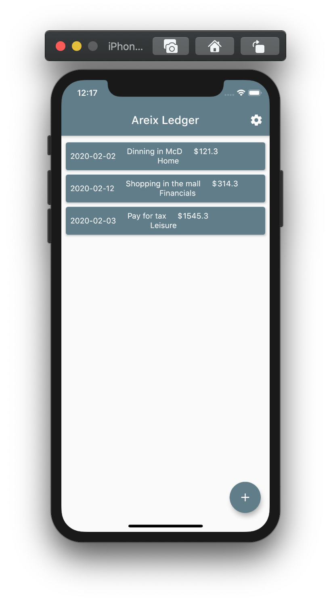
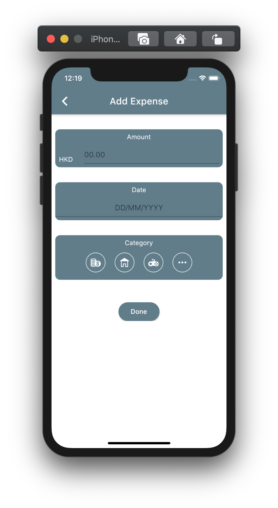

### Portfolio
#### Required Deliverables: 

##### Part 1 – Technical

1. Use Flutter to build the UI in the XD file
2. Animate graphics in UI with the use of your creativity
3. Build a UI features walkthrough for first-time onboarding
4. State Management (**IMPORTANT**)
5. API Integration
   - get portfolio list: 
     - GET portfolio/\<psid\>
   - get portfolio detail: 
     - GET portfolio/\<psid\>/\<portfolioid\>
   - create portfolio
     - POST portfolio/\<psid\>
   - add product to portfolio
     - PUT portfolio/\<psid\>
   - delete portfolio
     - DELETE portfolio/\<psid\>/\<portfolioid\>

Please note that the XD file, detail UI description, base url and psid will be send by email

##### Part 2 – Situational
There are 4 key functional features within the app: 
1. Home & Reward; 
2. Expense & Account; 
3. Budget & Goal; 
4. Marketplace & Portfolio. 

Given that the XD file is just 10% of the entire project. While 90% of the app is being completed at a functional stage, what is your plan of action to health-check the entire app before the app will be undergone a penetration test by an external auditing firm. For us to better understand your project handling skills and methodology, you could make fair-assumption on the priority and complexity. The plan shall at least cover the action items in upcoming 30 days.

Manpower: 1 Backend developer & 1-2 Junior software developer interns

1. Word/ PPT/ Excel that you find it better to illustrate the plan
2. A plan of action that for the app pre-launch, launch, post-launch
3. (Optional) CI/CD
 

### Deprecated Task1

 

# Account Analysis

Please examine XD file and build an mobile app using Flutter based on the design.

The API you might need to implement for API integration. GET networth/\<psid\>

### Deprecated Task2

 

# Introduction

Areix Ledger is an expense tracking mobile application which records the user expenses and creates an analytical view based on these expenses. Features include:

- categorizing expenses
- calculating and analyzing user expense
- allows user to perform sorting and filtering

# Requirements

- Use Flutter / React Native / Native Android/IOS  (If using Flutter, the UI code is provided)
- State Management (**IMPORTANT**)
- API Integration
    - If you completed the backend assessment, it is highly recommended to invoke your own API endpoints which you have developed in the backend assessment.
    - Otherwise you could use our mock up API endpoint: https://my-json-server.typicode.com/Areix/technical-assessment/expenses

# Task 1
Build a frontend page with filter which allow users to filter and see expenses.

<!-- 

 -->

- When user create a new expense record in the `Add Expense Page`, the `Expense List Page` will be updated accrodingly and display the new record
- Implement the sorting and filtering in the frontend page. 
    1. Filter by `category`
    2. Sort by `created_at`
    3. Filter by month (refer to `created_at`)

# Task 2 (Bonus task)
Build a frontend page which generate the bar/line/pie chart based on the user expenses for user better understanding their expense behaviour.

- The charts should be compatible with filtering 
- The charts shoud be dynamic, whcih means once a new expense record is added, the charts are expected to change accordingly

